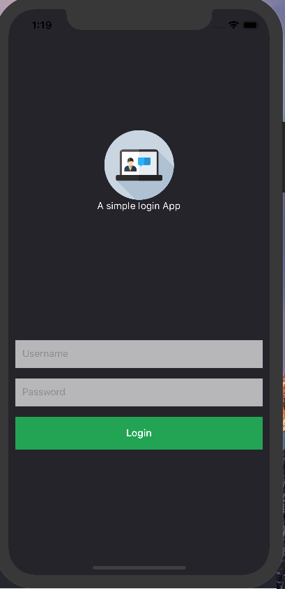

# react-native-login-component
### 画像を利用する際
- importで[Image]をする
```js

//例
import {
  View,
  Text,
  //これのこと
  Image,
  StyleSheet,
} from 'react-native';

export default class Login extends Component {
  render() {
    return (
      <View style={styles.container}>
        <View style={styles.loginwrap}>
        //ここで画像のパスを利用して読み込みでOK
          <Image source={require('./img/icon.png')}/>
        </View>
      </View>
    );
  }
```

```js
//スタイル
const styles = StyleSheet.create({
  container: {
    flex: 1,
  },
  loginwrap: {
    //flexGrowを使って(css だと自動的に伸びて余白を埋める)中央にもってきてる
    flexGrow: 1,
    alignItems: 'center',
    justifyContent: 'center',
  },
  logo: {
    width: 100,
    height: 100,
  }
});
```

- App.jsで全体に背景色をつける方法もあるが、Loginの方のcontainerにDimensionsを使うことでもコンポーネント全体にスタイルをつけられる
```js
import {
  View,
  Text,
  Image,
  //これを追加
  Dimensions,
  StyleSheet,
} from 'react-native';


//styles
const styles = StyleSheet.create({
  container: {
    flex: 1,
    backgroundColor: '#282830',
    //これで横に広げられる
    width: Dimensions.get('window').width,
  },

```

## TextInputを使って入力できるフォームを作る
- input用のコンポーネントを作成してimportで`TextInput`を使う placeholderのつづりまちがえるので注意
```js
import {
  View,
  Text,
  //これを読み込む
  TextInput,
  //これはタップでopacityがかかるやつ
  TouchableOpacity,
  StyleSheet,
} from 'react-native';
```

```js
//使い方
<TextInput
  placeholder="Username"
  style={styles.input}
/>
```

## TouchableOpacityの使い方
```js
export default class Myform extends Component {
  render() {
    return (
      <View style={styles.container}>
        <TextInput
          placeholder="Username"
          style={styles.input}
        />
        <TextInput
          placeholder="Password"
          style={styles.input}
        />
        //これでラップをしてあげるだけ、opacity効果がある
        <TouchableOpacity>
          <Text>button</Text>
        </TouchableOpacity>
      </View>
    );
  }
}

```

- paddingVerticalを使うと全方向にpadding効く
```js

<TouchableOpacity style={styles.buttonwrap}>
  <Text style={styles.buttonText}>Login</Text>
</TouchableOpacity>

//styleを当てると
const styles = StyleSheet.create({
  container: {
    flex: 1,
    padding: 10,
  },
  input: {
    height: 40,
    backgroundColor: 'rgba(255,255,255,0.7)',
    paddingLeft: 10,
    marginBottom: 15,
  },
  buttonwrap: {
    backgroundColor: '#27ae60',
    paddingVertical: 15,
  },
  buttonText: {
    textAlign: 'center',
    color: '#fff',
    fontWeight: 'bold',

  },
```
### スタイルを当てたイメージ

